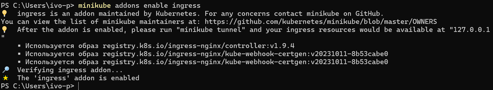
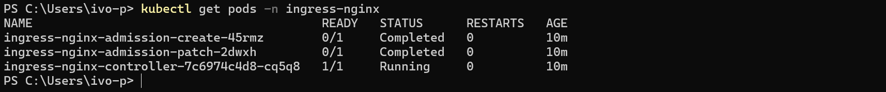
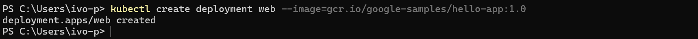
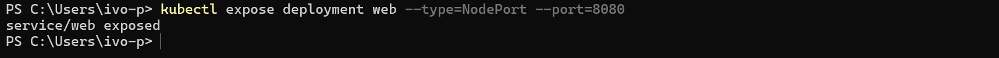
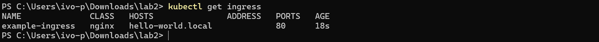
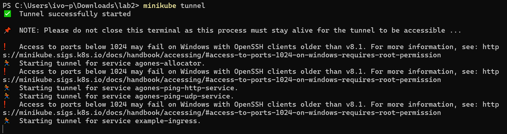
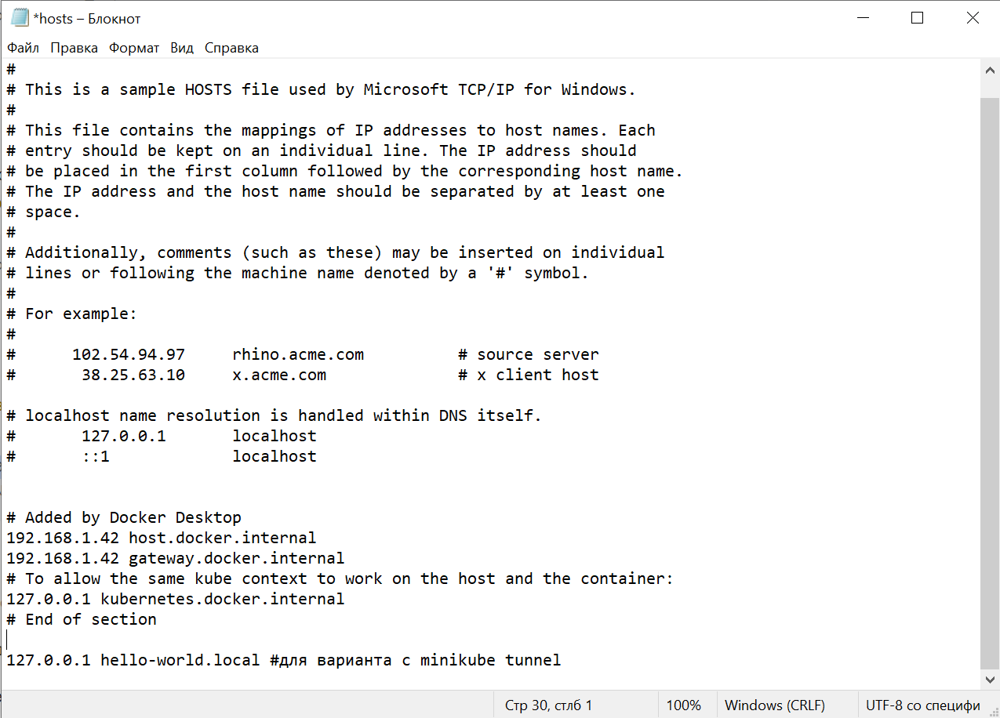
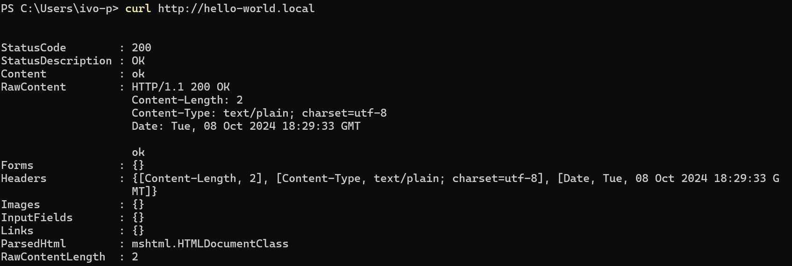

1. Включаем ingress в minikube

2. Проверяем запустился ли ingress controller

3. Запускаем hello-world

4. Создаем сервис типа NodePort

5. Создаем ingress-resource

6. Проверяем, что ingress-resource появился

7. (для всех остальных) Делаем ingress доступным на хостовой машине, это связано с особенностями minikube. Не закрываем данное окно!!!

8. Ingress на входе ожидает хост hello-world.local, поэтому нужно добавить мапинг на хостовой машине в файл /etc/hosts для UNIX-based систем.

ИТОГ:

